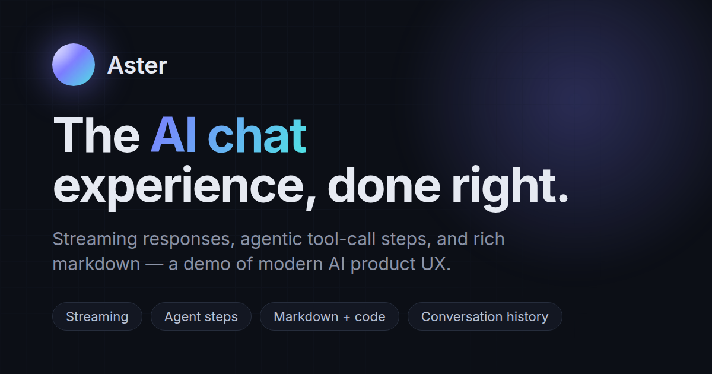
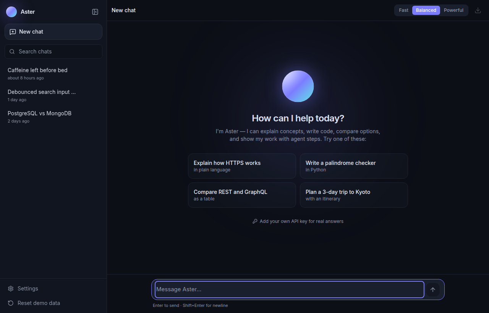
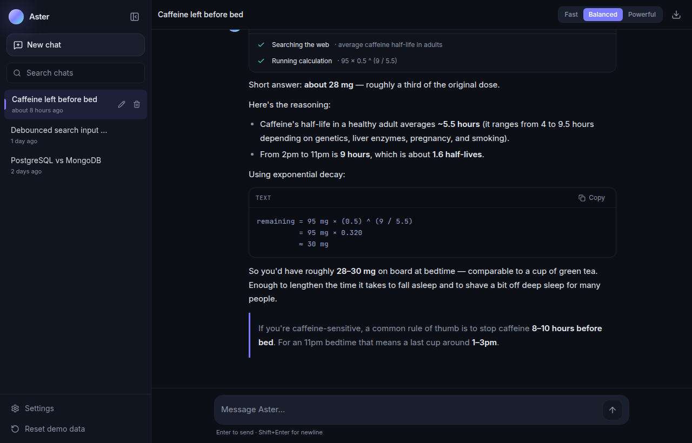
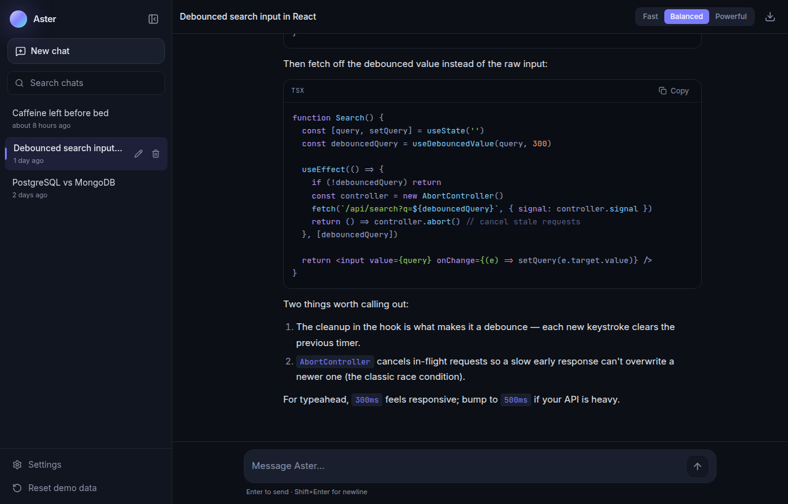
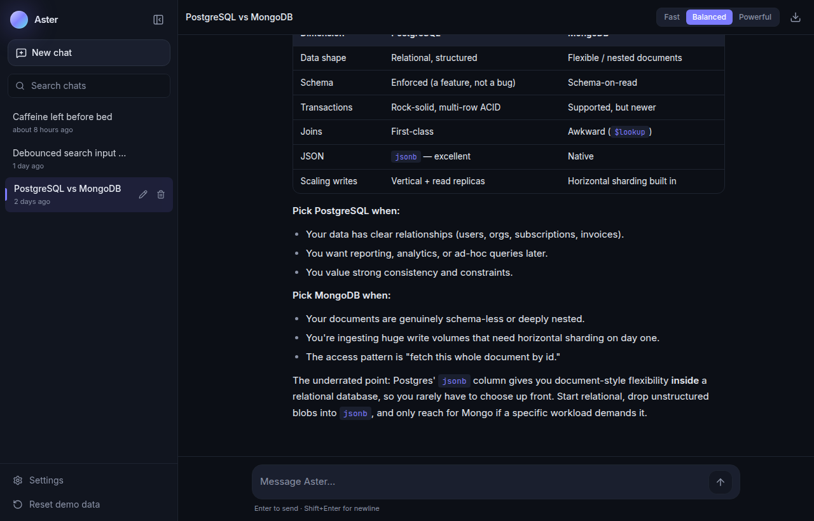
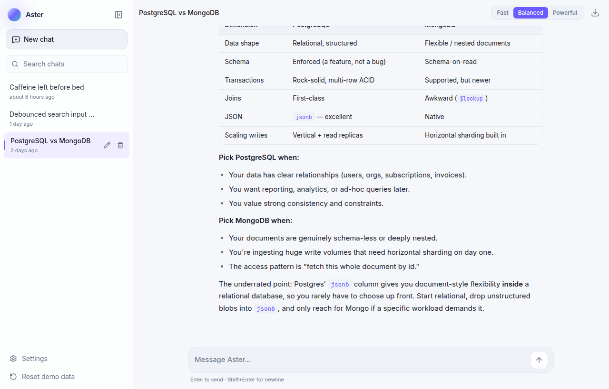
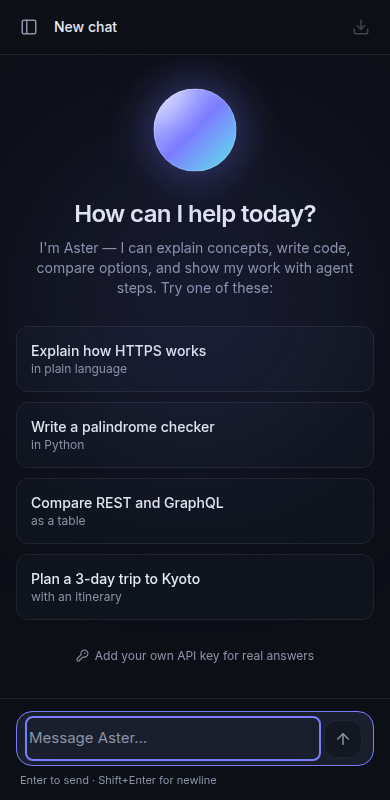

# Aster — AI Chat Assistant

A polished demo of modern **AI product UX**: word-by-word streaming, agentic
tool-call steps, rich markdown with syntax-highlighted code, and persistent
conversation history — all running in the browser, no backend required.

**Live demo:** [ai-chat-assistant-iota-six.vercel.app](https://ai-chat-assistant-iota-six.vercel.app)



---

## Highlights

- **Streaming responses** — answers stream token by token with a blinking caret
  and a shimmering "thinking" state, plus **Stop** mid-stream and **Regenerate**.
- **Agent steps (the signature)** — collapsible tool-call blocks (_"Searching the
  web…"_, _"Running calculation…"_) whose spinners resolve to checks before the
  answer streams in. This is the piece almost no portfolio demos show.
- **Rich markdown** — GitHub-flavored markdown with tables, lists, blockquotes,
  and fenced code blocks with language labels and a **copy button that morphs to
  a checkmark**.
- **Conversations** — persisted locally, auto-titled from the first message, with
  search, inline rename, and delete.
- **Edit & resend** your last message, a cosmetic **Fast / Balanced / Powerful**
  model picker, a character counter, and **export to Markdown**.
- **Auto-scroll** while streaming, with a "scroll to latest" pill when you scroll up.
- **Bring your own API key** — an optional mode that streams from OpenAI's chat
  completions endpoint directly from the browser; the key lives only in
  `localStorage` with a clear warning.
- **Dark-first** design with a light theme, fully responsive (375 / 768 / 1280),
  keyboard-friendly (Escape closes modals, Enter sends), and
  `prefers-reduced-motion` aware.

## Screenshots

| Empty state | Agent steps |
| --- | --- |
|  |  |

| Code blocks | Tables |
| --- | --- |
|  |  |

| Light theme | Mobile |
| --- | --- |
|  |  |

## Architecture

The UI never touches `localStorage` directly. Every read and write goes through
a single **API-shaped data layer** ([`src/lib/storage.ts`](src/lib/storage.ts))
whose functions are `async`, add 200–500 ms of simulated latency, and version
their keys (`aster.v1.*`) — so loading skeletons and optimistic updates are real,
and swapping in a real backend (Node, Laravel, anything) is a **one-file change**.
The response engine ([`src/lib/engine.ts`](src/lib/engine.ts)) is a unified async
generator: with no API key it streams keyword-matched mock answers and fake agent
steps; drop in a key and the exact same consumer streams Server-Sent Events from a
real model. State lives in a small [Zustand](https://github.com/pmndrs/zustand)
store; everything else is presentational.

## Tech stack

Vite · React · TypeScript · Tailwind CSS v4 · Motion · Zustand · React Router ·
react-markdown + rehype-highlight · lucide-react · sonner · date-fns.

## Getting started

```bash
npm install
npm run dev      # start the dev server
npm run build    # type-check + production build
npm run preview  # preview the production build
```

Seed data (3 rich prefab conversations demonstrating code, tables, and agent
steps) loads automatically on first visit. Use **Reset demo data** in the sidebar
to restore it at any time.
